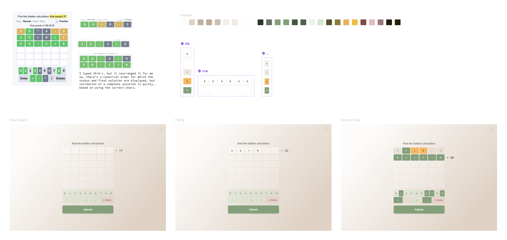

# Mathler Clone w/ Login via Dynamic SDK

A clone of the [Mathler](https://mathler.com) game, built with React and
TypeScript, including a profile system using the [Dynamic
SDK](https://www.dynamic.xyz/docs/react-sdk/overview), allowing users to save
their progress based on their wallet address.

## Notes

Since I'm coming from a DeFi startup where I built web3 tooling (e.g.,
[Drift](https://delvtech.github.io/drift/)), and UI's dense with blockchain
interactions (e.g., [Hyperdrive
Frontend](https://github.com/delvtech/hyperdrive-frontend)), I decided to focus
less on crypto-related features in this project. Instead, I spent more time on
the design, UX, and keeping dependencies minimal to showcase skills that aren't
as visible in my recent work.

## Design

I started the design in Figma, aiming for something clean and peaceful, and
finished the details in code with extra attention to the details.

